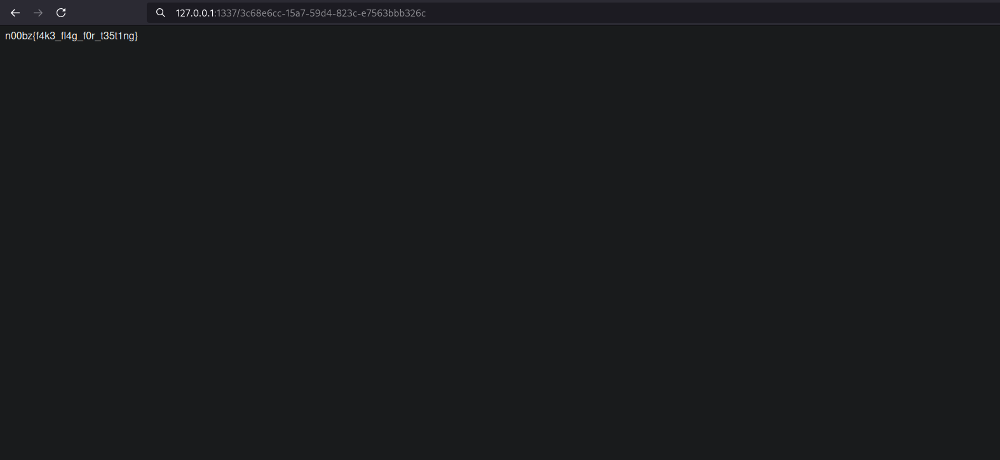

## Challenges
- [Passwordless](#passwordless)

### Passwordless
Tired of storing passwords? No worries! This super secure website is passwordless!
- - -
For this challenge, we had to exploit a program weakness.

**app.py**
```py
#!/usr/bin/env python3
from flask import Flask, request, redirect, render_template, render_template_string
import subprocess
import urllib
import uuid
global leet

app = Flask(__name__)
flag = open('/flag.txt').read()
leet=uuid.UUID('13371337-1337-1337-1337-133713371337')

@app.route('/',methods=['GET','POST'])
def main():
    global username
    if request.method == 'GET':
        return render_template('index.html')
    elif request.method == 'POST':
        username = request.values['username']
        if username == 'admin123':
            return 'Stop trying to act like you are the admin!'
        uid = uuid.uuid5(leet,username) # super secure!
        return redirect(f'/{uid}')

@app.route('/<uid>')
def user_page(uid):
    if uid != str(uuid.uuid5(leet,'admin123')):
        return f'Welcome! No flag for you :('
    else:
        return flag

if __name__ == '__main__':
    app.run(host='0.0.0.0', port=1337)
```
Looking at the source, the flag can be retrieved via the `user_page()` route. The route compares the **UID** input from the user to the hard-coded **UUID5**.

#### Solution
In a Python terminal...
```
>>> import uuid
>>> leet=uuid.UUID('13371337-1337-1337-1337-133713371337')
>>> str(uuid.uuid5(leet, 'admin123'))
'3c68e6cc-15a7-59d4-823c-e7563bbb326c'
>>>
```

Now that we have our target **UID**, let's send it to the route: `http://127.0.0.1:1337/3c68e6cc-15a7-59d4-823c-e7563bbb326c`



Voila! We have our flag: `n00bz{f4k3_fl4g_f0r_t35t1ng}`
