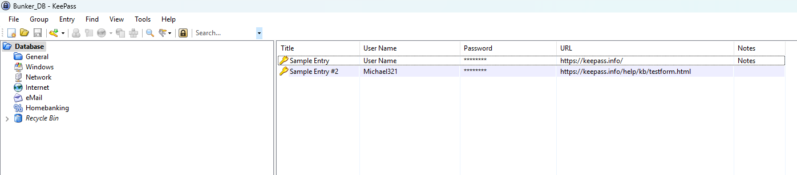
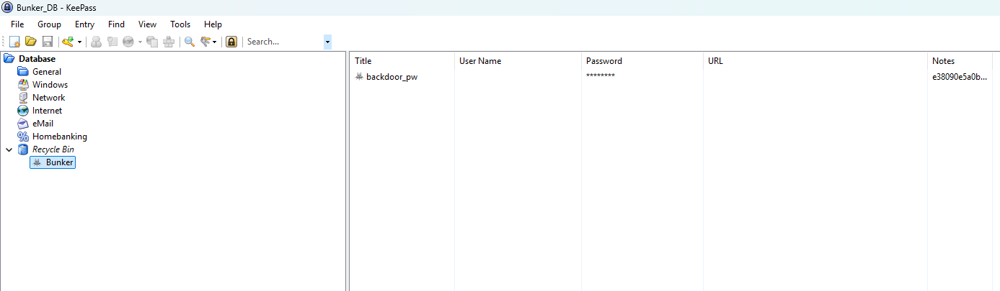
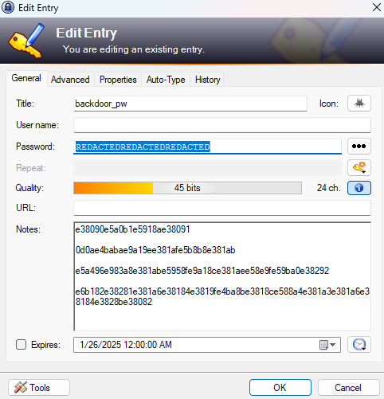
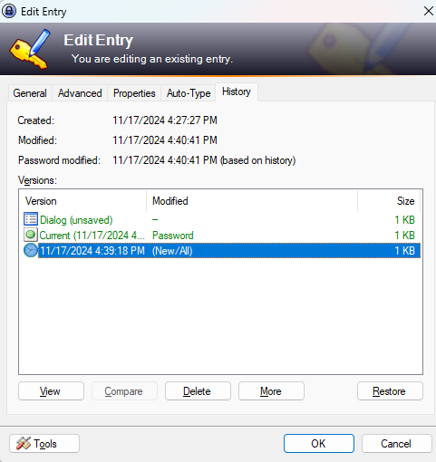
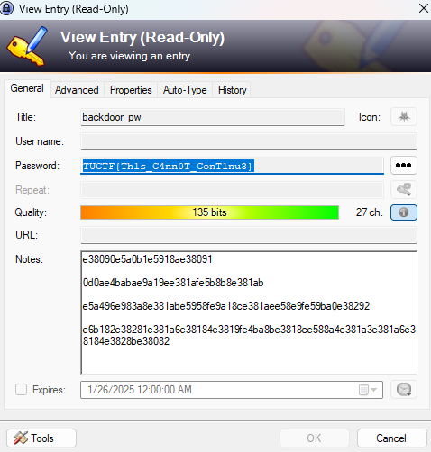

## Challenges
- **Forensics**
    - [Bunker](#Bunker)

### Bunker
You were given an 7z archive: `Bunker.7z`. Inside were two files: `BUNKER_DB` and `BUNKER_DMP`.
- - -
Without any file extensions, I had no idea what these files were. However, judging by the **DB** and **DMP**, I assumed they were a database and dump file.
```shell
Bunker_DB:  Keepass password database 2.x KDBX
Bunker_DMP: Mini DuMP crash report, 17 streams, Sun Nov 17 22:47:09 2024, 0x621826 type
```
A KeePass password database and a minidump crash report... interesting.

#### Investigating the dump
I tried multiple methods of trying to analyze the dump and used programs such as WinDBG, BlueScreenView, etc. But, I couldn't find anything valuable.
So, I decided to look up how a KeePass database and a minidump related to one another.

Turns out, there's a tool for that. In this case, I used this GitHub repo: https://github.com/JorianWoltjer/keepass-dump-extractor.

Running the program, this is what I got in return.
```shell
keepass-dump-extractor Bunker_DMP -f gaps

●L0Ry_2_M4nk1Nd!_Y0RH4
●ǿ0Ry_2_M4nk1Nd!_Y0RH4
●Ḁ0Ry_2_M4nk1Nd!_Y0RH4
●§0Ry_2_M4nk1Nd!_Y0RH4
●Ȁ0Ry_2_M4nk1Nd!_Y0RH4
```

Examining the output, it looks like the first letter in the password is probably going to be a `g` or `G`.

#### Unlocking the KeePass database
I installed KeePass on my machine and opened the database file. Trying the lowercase G seemed to work: **gL0Ry_2_M4nk1Nd!_Y0RH4**.



At first glance, it looks like these two entries are added by default. Viewing the passwords, yeah... they were. But, at the left, there seems to be a *Recycle Bin*. Opening it up, there's a **Bunker** group.



There it is, the flag hidden in the password, or so I thought. Opening it up, it seems that the password is "redacted".



Well, there's a history tab. Let's view that shall we.



There's a version from **11/17/2024**, let's view that. Looking at the password for that history entry, we got the flag!



#### Conclusion
This was a fun and unique forensics challenge. Despite falling down the rabbit hole of examining the dump file, persistance led to the flag.